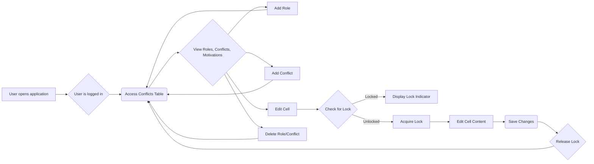

# Table Interaction User Flow

This document describes the user flow for interacting with the Conflicts Table in the LARP Conflicts Table Tool.

## Flow Diagram

## Steps

1.  **User opens application:** The user navigates to the application URL.
2.  **User is logged in:** The user is already logged in (see `authentication-flow.md`).
3.  **Access Conflicts Table:** The user accesses the main conflicts table view.
4.  **View Roles, Conflicts, Motivations:** The user sees the existing roles, conflicts, and motivations in the table.
5.  **Add Role:** The user clicks the "Add Role" button and enters a new role name.
6.  **Add Conflict:** The user clicks the "Add Conflict" button and enters a new conflict name.
7.  **Edit Cell:** The user clicks on a cell to edit its content.
8.  **Delete Role/Conflict:** The user clicks the delete button next to a role or conflict to remove it.
9.  **Check for Lock (when editing):** The application checks if the cell is already locked by another user.
10. **Display Lock Indicator (if locked):** If the cell is locked, a lock indicator is displayed.
11. **Acquire Lock (if unlocked):** If the cell is unlocked, the application acquires a temporary lock.
12. **Edit Cell Content:** The user enters or modifies the cell content.
13. **Save Changes:** The changes are automatically saved to Google Sheets.
14. **Release Lock:** The lock on the cell is released.

## Real-time Collaboration

- Changes made by other users are reflected in real-time.
- Active users are displayed in the presence list.
- Cells being edited by other users are indicated with a colored border and the user's avatar.
